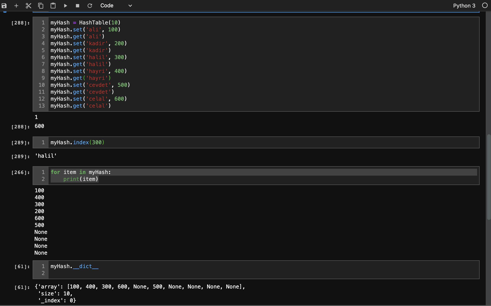

# Hash Table Implementation

This is a [Hash Table](https://en.wikipedia.org/wiki/Hash_table) Implementation for Python which is Dictionary. Uses [open addressing](https://en.wikipedia.org/wiki/Hash_table#Open_addressing) technique for collisions.

> * Can set a key and value
> * Iter through the items
> * Can call value by key or key by value

